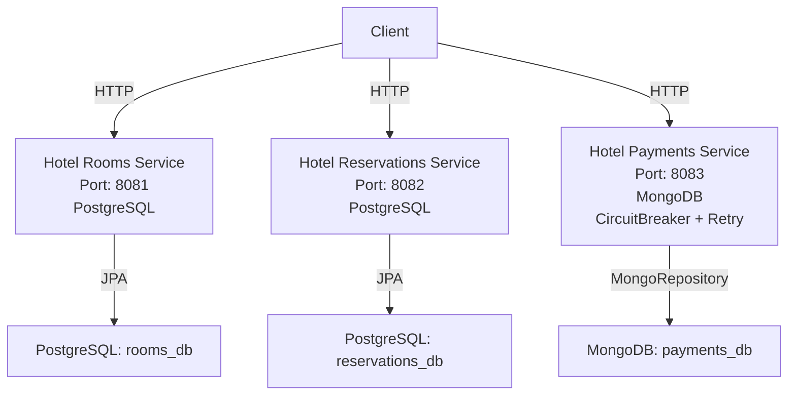

# SpringResilientHotel | Cloud-Native Microservices w/ Fault-Tolerant Patterns & Resilience4j

> **"Showcasing Circuit Breaker + Retry patterns in hospitality microservices (PostgreSQL+MongoDB)"**

[](https://www.oracle.com/java/)
[](https://spring.io/projects/spring-boot)
[](https://maven.apache.org/)
[](https://resilience4j.readme.io/)
[](https://www.postgresql.org/)
[](https://www.mongodb.com/)
[](https://swagger.io/)

---

## Project Overview

**SpringResilientHotel** is a robust hotel reservation system built using a microservices architecture with Spring Boot 3. This project showcases a scalable, resilient, and maintainable solution for managing hotel bookings, leveraging advanced design patterns like **CircuitBreaker** and **Retry** (via Resilience4j), alongside **Specification** and **Factory** patterns. It consists of three core microservices: room management, reservation handling, and payment processing, each designed to operate independently while ensuring fault tolerance and seamless user experience.

### Key Features & Design Patterns
- **Microservices Architecture**: Independent services for rooms (`hotel-rooms-service`), reservations (`hotel-reservations-service`), and payments (`hotel-payments-service`), enabling scalability and isolated deployment.
- **CircuitBreaker (Resilience4j)**: Protects the payment service from cascading failures by switching to a fallback (`"status": "PENDING"`) when thresholds are exceeded, ensuring system stability.
- **Retry (Resilience4j)**: Enhances resilience in the payment service with automatic retries (up to 3 attempts with exponential backoff) for transient failures.
- **Specification Pattern**: Filters available rooms based on criteria like guest count and price, improving code reusability and business logic encapsulation.
- **Factory Pattern**: Centralizes reservation object creation, promoting consistency and reducing coupling.

### Technologies
- **Spring Boot 3.2.4**: Modern framework for building microservices.
- **Maven**: Dependency management and build tool.
- **PostgreSQL**: Relational database for rooms and reservations.
- **MongoDB**: NoSQL database for payment records.
- **Resilience4j**: Fault tolerance library for CircuitBreaker and Retry.
- **Swagger/OpenAPI**: API documentation and testing interface.

### Purpose
This project demonstrates a production-ready microservices ecosystem for hotel booking systems, emphasizing resilience, fault tolerance, and clean code principles. It’s ideal for developers and companies seeking to explore or adopt scalable, distributed architectures with modern Java technologies.

---

## Architecture Diagram



---

## Getting Started

### Prerequisites
- **Java 17**: Install JDK 17 (e.g., OpenJDK or Oracle JDK).
- **Maven**: Ensure Maven is installed (`mvn -v` to verify).
- **PostgreSQL**: Set up PostgreSQL locally (e.g., via Docker: `docker run -p 5432:5432 -e POSTGRES_PASSWORD=password postgres`).
- **MongoDB**: Run MongoDB locally (e.g., via Docker: `docker run -p 27017:27017 mongo`).
- **Postman**: Optional, for manual API testing.

### Database Setup
1. **PostgreSQL**:
    - Create databases `rooms_db` and `reservations_db`:
      ```sql
      CREATE DATABASE rooms_db;
      CREATE DATABASE reservations_db;
      ```
    - Default credentials: `user=postgres`, `password=password`. Update `application.properties` in `hotel-rooms-service` and `hotel-reservations-service` if different.

2. **MongoDB**:
    - Start MongoDB:
      ```bash
      mongod
      ```
    - The `payments_db` database will be created automatically on first use.

### Clone the Repository
```bash
git clone https://github.com/xsoto-developer/SpringResilientHotel.git
cd SpringResilientHotel
```

### Run the Services
Open a separate terminal for each service and execute:

1. **Rooms Service (`hotel-rooms-service`)**:
   ```bash
   cd hotel-rooms-service
   mvn clean install
   mvn spring-boot:run
   ```
    - Runs on: `http://localhost:8081`

2. **Reservations Service (`hotel-reservations-service`)**:
   ```bash
   cd hotel-reservations-service
   mvn clean install
   mvn spring-boot:run
   ```
    - Runs on: `http://localhost:8082`

3. **Payments Service (`hotel-payments-service`)**:
   ```bash
   cd hotel-payments-service
   mvn clean install
   mvn spring-boot:run
   ```
    - Runs on: `http://localhost:8083`

### Verification
- Check logs for successful startup (e.g., "Tomcat initialized with port(s)").
- Access Swagger UI for each service (see below).

---

## Swagger/OpenAPI Documentation

Each microservice provides Swagger/OpenAPI documentation for easy API exploration and testing:
- **Rooms Service**: [http://localhost:8081/swagger-ui.html](http://localhost:8081/swagger-ui.html)
- **Reservations Service**: [http://localhost:8082/swagger-ui.html](http://localhost:8082/swagger-ui.html)
- **Payments Service**: [http://localhost:8083/swagger-ui.html](http://localhost:8083/swagger-ui.html)

---

## Testing the Services

### Example: Find Available Rooms
```bash
curl -X GET "http://localhost:8081/rooms/available?guestCount=2&maxPrice=200.0" -H "Content-Type: application/json"
```

### Example: Create a Reservation
```bash
curl -X POST "http://localhost:8082/reservations" -H "Content-Type: application/json" -d '{"roomId":"room1","checkIn":"2025-04-15","checkOut":"2025-04-20","guestCount":2}'
```

### Example: Process a Payment
```bash
curl -X POST "http://localhost:8083/payments/process" -H "Content-Type: application/json" -d '{"reservationId":"test-reservation-123","amount":150.0}'
```
- Expected responses: `"status": "COMPLETED"` (success) or `"status": "PENDING"` (fallback).

#### Testing CircuitBreaker & Retry
1. Send multiple payment requests:
   ```bash
   curl -X POST "http://localhost:8083/payments/process" -H "Content-Type: application/json" -d '{"reservationId":"test-reservation-123","amount":150.0}'
   ```
2. Monitor logs for:
    - **Retry**: Up to 3 attempts with exponential backoff (~30% failure rate).
    - **CircuitBreaker**: Switches to `OPEN` after 5 failures (50% of 10), returning `"status": "PENDING"`.
3. Check metrics:
   ```bash
   curl http://localhost:8083/actuator/metrics/resilience4j.circuitbreaker.state
   curl http://localhost:8083/actuator/metrics/resilience4j.retry.calls
   ```

---

## Key Considerations for Successful Execution

1. **System Dependencies**:
    - Ensure Java 17, Maven, PostgreSQL, and MongoDB are installed and running.
    - Verify dependency compatibility in `pom.xml` (e.g., Resilience4j 2.2.0 with Spring Boot 3.2.4).

2. **Database Configuration**:
    - PostgreSQL: Create `rooms_db` and `reservations_db` with default credentials (`postgres`/`password`) or update `application.properties`.
    - MongoDB: Accessible at `localhost:27017` (adjust URI if needed).

3. **Startup Order**:
    - Start databases (PostgreSQL, MongoDB) before launching services with `mvn spring-boot:run`.

4. **Resilience4j Tuning**:
    - Adjust CircuitBreaker (`failureRateThreshold`, `waitDurationInOpenState`) and Retry (`maxAttempts`, `waitDuration`) in `application.properties` based on real-world needs.
    - Example: Increase `maxAttempts` for unstable payment gateways.

5. **Logging & Monitoring**:
    - Logs set to `DEBUG` for Resilience4j and project packages. Check console output for troubleshooting.
    - Use Actuator endpoints for real-time metrics (e.g., circuit state).

6. **Failure Simulation**:
    - Payment service simulates failures (`Math.random() > 0.7`). For controlled testing, revert to `callCount` logic in `PaymentService.java`.

7. **Testing**:
    - Use Swagger or Postman for endpoint validation.
    - Verify data persistence:
        - PostgreSQL: `SELECT * FROM room;` and `SELECT * FROM reservation;`
        - MongoDB: `use payments_db; db.payments.find().pretty();`

8. **Production Readiness**:
    - Add an API Gateway (e.g., Spring Cloud Gateway) and message queues (e.g., RabbitMQ) for inter-service communication in a production environment.

---

## Contributing
Contributions are welcome! To contribute:
1. Fork the repository.
2. Create a feature branch (`git checkout -b feature/new-feature`).
3. Commit your changes (`git commit -m "Add new feature"`).
4. Push to your branch (`git push origin feature/new-feature`).
5. Open a pull request.
